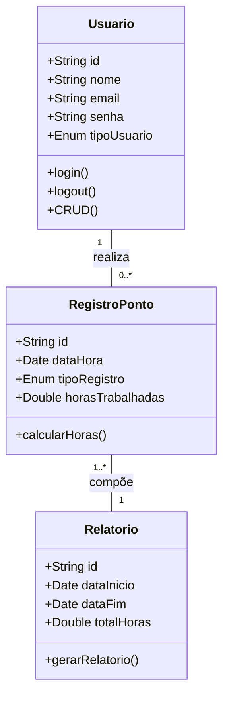
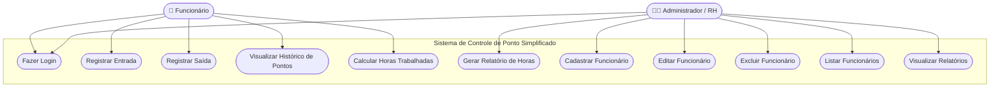

<h1 align="center">Sistema de Controle de Ponto Simplificado</h1>


---

## Briefing

O **Sistema de Controle de Ponto Simplificado (SCPS)** foi desenvolvido para substituir o processo manual de marcação de ponto do escritório fictício **DevSolutions**.  
O sistema permite registrar **entrada e saída**, gerar **relatórios automáticos** e calcular **horas trabalhadas** de forma ágil e digital.

---

## Objetivo do Projeto

- Automatizar o registro de ponto dos funcionários.  
- Exibir histórico de marcações diárias e mensais.  
- Facilitar o cálculo das horas trabalhadas.  
- Reduzir o tempo gasto pelo RH nos cálculos manuais.

---

## Público-Alvo

- **Administrador / RH:** Gerencia os funcionários e gera relatórios.  
- **Funcionário:** Registra ponto e visualiza o próprio histórico.

---

##  Requisitos do Sistema

###  Requisitos Funcionais
- CRUD de funcionários (Admin)  
- Login e autenticação (Admin / Funcionário)  
- Registro de ponto (Entrada / Saída)  
- Histórico de pontos por funcionário  
- Cálculo automático de horas trabalhadas  


### Requisitos Não Funcionais
- Banco de dados **MongoDB**  
- Interface responsiva (TailwindCSS)  
- Tempo de resposta < 300ms  
- Timezone padrão: `America/Sao_Paulo`

---

## Tecnologias Utilizadas

| Tecnologia | Descrição |
|-------------|------------|
| **Next.js** | Framework React para front e back-end |
| **TailwindCSS** | Estilização moderna e responsiva |
| **MongoDB / Mongoose** | Banco de dados NoSQL |
| **NextAuth** | Autenticação e controle de sessão |
| **TypeScript** | Tipagem estática e robustez |

- ### Pessoal
 - Julya Estrela
---


🧩 Diagrama de Classes



## Diagrama de Caso de Uso

O diagrama abaixo ilustra as interações dos diferentes tipos de usuários com as funcionalidades do **Sistema de Controle de Ponto Simplificado (SCPS)**.



##  Fluxo 

O diagrama abaixo mostra o **fluxo geral de funcionamento** do sistema, desde o login até o registro de ponto e geração de relatórios.

```mermaid
flowchart TD

%% ===== Início =====
A[ Início] --> B[ Login]

B --> C{Tipo de Usuário?}

%% ===== Fluxo Funcionário =====
%% ===== Fluxo Funcionário =====
C --> D["🧍 Funcionário"]
D --> E[Acessa Painel do Funcionário]
E --> F[Registrar Ponto]
F --> G{Último registro foi Entrada?}
G --> H[Registrar Saída]
G --> I[Registrar Entrada]
H --> J[Salvar Registro de Saída no Banco de Dados]
I --> K[Salvar Registro de Entrada no Banco de Dados]
J --> L[Calcular Total de Horas Trabalhadas do Dia]
K --> L
L --> M[Visualizar Histórico de Pontos]
M --> N[Logout]
N --> Z([Fim])

%% ===== Fluxo Administrador =====
C --> O["🧑‍💼 Administrador (RH)"]
O --> P[Acessa Painel Administrativo]
P --> Q[Gerenciar Funcionários]
Q --> R{Ação?}
R --> S[Cadastrar Funcionário]
R --> T[Editar Dados]
R --> U[Excluir Funcionário]
S --> V[Salvar no Banco de Dados]
T --> V
U --> V
V --> W[Gerar Relatório de Horas Trabalhadas]
W --> X[Exportar Relatório (PDF/Excel)]
X --> Y[Logout]
Y --> Z
```

## Prototipos

## Codificação do Projeto