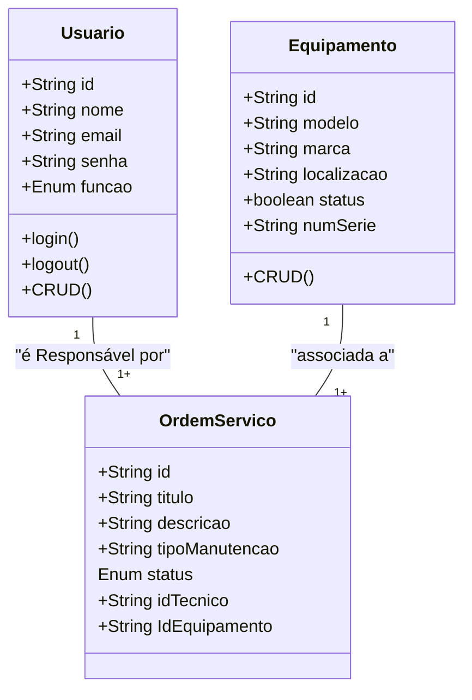

# Sistema de Gestão de Manutenção (SGM) 

## Briefing
O projeto consiste no desenvolvimento de um Sistema de Gestão de Manutenção (SGM) no formato de uma aplicação web. O objetivo é centralizar e otimizar o controle das atividades de manutenção de máquinas e equipamentos de uma empresa. A plataforma permitirá o cadastro de equipamentos, agendamento de manutenções preventivas e corretivas, e o gerenciamento de ordens de serviço.

## Objetivo do Projeto
- Gerenciar informações sobre equipamentoe manutenções realizadas pela empresa.
- Realizar abertura de chamdos de manutenção (ordens se serviço).
- Dashboard de históricos de manutenção.
- Proteger acesso aos dados do sitema (criptografia e autenticação segura de usuários).

## Público-Alvo
- Tecnicos de manutenção (usuários finais).
- Gestores de Manutenção (usuários intermediários)
- Administradores do Sistema (Gerenciar a permissão dos usuários).

## Levantamento de Requisitos do projeto
- ### Requisitos Funcionais
- ### Requisitos Não Funcionais

## Recursos do Projeto
- ### Tecnológicos 
  -Framework de Desenvolvimento Next/React
  - Linguagem de programação: TypeScript
  - Banco de Dados Não Relacional (MongoDB)
  - Gitbub
  - VsCode
  - Figma

- ### Pessoal
   -Dev Tudo

## Análise de Riso

## Diagramas
 1. ### CLasses
 Descrever o comportamento das Entidades de um projeto
   -Usuário (User/Usuario)
       -Atributos: id, nome, email, senha, função
       -Métodos: create, read, update, delete, login, logout
   -Equipamento (Equipament)
       - Atributos:id, modelo, marca, localização, status, numeroSerie.
       Métodos: CRUD
    
   - Ordem de Serviço (OrdemServico)
        - Atributos:  id, titulo, descricao, tipoManutenção, status, idTecnico, IdEquipamento




```