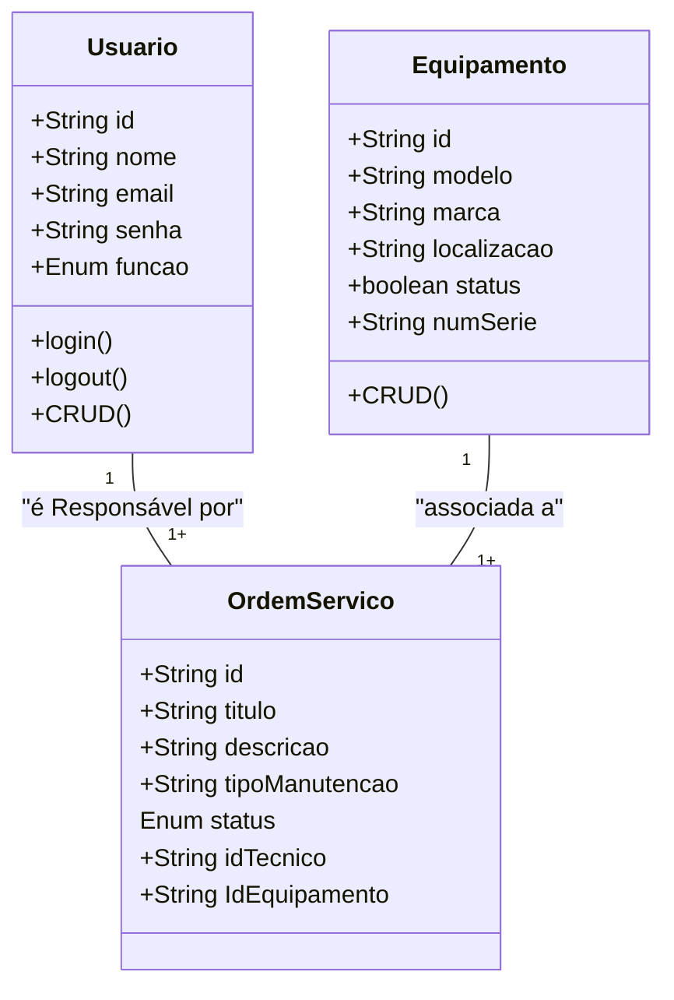
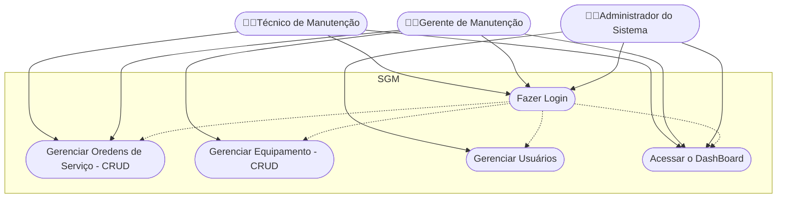
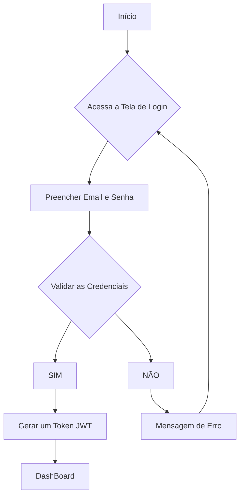

# Sistema de Gestão de Manutenção (SGM) 

## Briefing
O projeto consiste no desenvolvimento de um Sistema de Gestão de Manutenção (SGM) no formato de uma aplicação web. O objetivo é centralizar e otimizar o controle das atividades de manutenção de máquinas e equipamentos de uma empresa. A plataforma permitirá o cadastro de equipamentos, agendamento de manutenções preventivas e corretivas, e o gerenciamento de ordens de serviço.

## Objetivo do Projeto
- Gerenciar informações sobre equipamentoe manutenções realizadas pela empresa.
- Realizar abertura de chamdos de manutenção (ordens se serviço).
- Dashboard de históricos de manutenção.
- Proteger acesso aos dados do sitema (criptografia e autenticação segura de usuários).

## Público-Alvo
- Tecnicos de manutenção (usuários finais).
- Gestores de Manutenção (usuários intermediários)
- Administradores do Sistema (Gerenciar a permissão dos usuários).

## Levantamento de Requisitos do projeto
### Requisitos Funcionais (RF)

1. **Autenticação e Autorização**
   - RF1.1: Login com e-mail e senha.
   - RF1.2: Recuperação de senha via e-mail.
   - RF1.3: Controle de permissões por função (Técnico, Gestor, Admin).
   - RF1.4: Geração e validação de JWT.

2. **Gerenciamento de Usuários**
   - RF2.1: CRUD de usuários (Admin).
   - RF2.2: Atribuição de função.
   - RF2.3: Auditoria básica (quem criou/alterou e quando).

3. **Gerenciamento de Equipamentos**
   - RF3.1: CRUD de equipamentos.
   - RF3.2: Campos: id, modelo, marca, localização, status, número de série, fabricante, data de compra, vida útil estimada, observações.
   - RF3.3: Upload e visualização de documentos/imagens.

4. **Ordens de Serviço (OS)**
   - RF4.1: Criação de OS com título, descrição, equipamento, tipo de manutenção, prioridade, técnico atribuído.
   - RF4.2: Status da OS: Aberta, Em Progresso, Aguardando Peça, Concluída, Cancelada.
   - RF4.3: CRUD de OS conforme permissão do usuário.
   - RF4.4: Comentários e registro de atividades (logs) por OS.
   - RF4.5: Anexar arquivos ou imagens como evidência.
   - RF4.6: Fechamento da OS com checklist e tempo gasto.

5. **Manutenção Preventiva**
   - RF5.1: Criar planos de manutenção (periodicidade diária, semanal, mensal ou baseado em horas de uso).
   - RF5.2: Geração automática de OS para manutenções agendadas.
   - RF5.3: Calendário com visualização das manutenções previstas.

6. **Dashboard e Relatórios**
   - RF6.1: Dashboard com KPIs: OS abertas, tempo médio de atendimento, falhas por equipamento, manutenção prevista.
   - RF6.2: Filtros por período, equipamento, tipo de manutenção, técnico.
   - RF6.3: Exportar relatórios em CSV/PDF.

7. **Notificações**
   - RF7.1: Notificações por e-mail e in-app: nova OS atribuída, OS com prazo próximo, conclusão de OS.

8. **Segurança e Compliance**
   - RF8.1: Criptografia de senhas (bcrypt/argon2) e dados sensíveis.
   - RF8.2: Logs de acesso e operações críticas.
   - RF8.3: Políticas de senha e bloqueio após tentativas.

### Requisitos Não Funcionais (RNF)

- RNF1: Aplicação responsiva (desktop e tablet prioritário).
- RNF2: Disponibilidade mínima de 99%.
- RNF3: Tempo de resposta das APIs < 300ms.
- RNF4: Backups diários do MongoDB.
- RNF5: Logs centralizados.
- RNF6: Internacionalização (pt-BR como padrão, possibilidade de outros idiomas).

## Recursos do Projeto
- ### Tecnológicos 
  -Framework de Desenvolvimento Next/React
  - Linguagem de programação: TypeScript
  - Banco de Dados Não Relacional (MongoDB)
  - Gitbub
  - VsCode
  - Figma

- ### Pessoal
   -Dev Tudo

## Análise de Riso

## Diagramas
 1. ### CLasses
 Descrever o comportamento das Entidades de um projeto
   -Usuário (User/Usuario)
       -Atributos: id, nome, email, senha, função
       -Métodos: create, read, update, delete, login, logout
   -Equipamento (Equipament)
       - Atributos:id, modelo, marca, localização, status, numeroSerie.
       Métodos: CRUD
    
   - Ordem de Serviço (OrdemServico)
        - Atributos:  id, titulo, descricao, tipoManutenção, status, idTecnico, IdEquipamento

2. ### Caso de Uso
Ilustra as interações dos diferentes tipos de usuários (Atores) com as funcionalidade do sistema

- Caso de Uso:
    - Técnico: Gerenciar Ordens de Serviço (CRUD) e acessar o Dashboard;
    - Gerente: funções do técnico + Gerenciamento de Equipamentos (CRUD);
    - Admin: Gerenciar Usuários do Sistema, acessar o Dashboard

    Fazer o login -> Antes de Qualquer Ação 

3. ### Fluxo
Detalha o passo a passo para realizar uma ação no sistema

- Diagrama de fluxo de Login
    - O usuário acessa a tela de login
    - Insere as credenciais
    - O sistema verifica as Credenciais
        - se sim: ger um JWT (Token) => Dashboard
        - se não: manda uma mensagem de erro - Permanece na tela de Login

## Prototipos
https://www.figma.com/design/1fnHKOzZh41vA6Sirc3K8n/Untitled?node-id=1-27&t=eNJMD7SVnhCNXGgZ-0

## Codificação do Projeto
