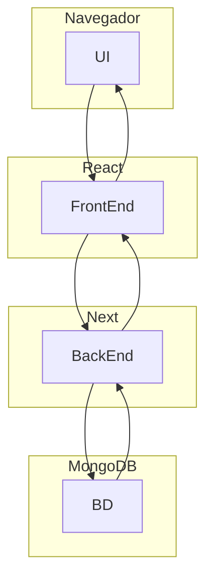

# Criar um diagrama de arquitetura

```mermaid

graph TD
    subgraph Interface["Navegador"]
        UI
    end    

    subgraph Front["React"]
        FrontEnd
    end

    subgraph Back["Next"]
       BackEnd
    end

    subgraph Banco[""MongoDB]
      BD
    end

    %% fluxo
    UI -->FrontEnd
    FrontEnd --> BackEnd
    BackEnd --> BD
    BD --> BackEnd
    BackEnd --> FrontEnd
    FrontEnd --> UI 
```    